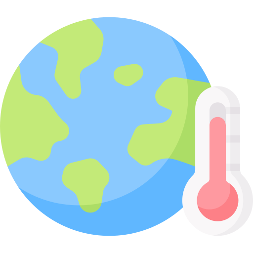

  

## A data-driven story about what we study, what we miss, and what comes next

Climate change is one of the most urgent issues of our time. But the way we see it—the photos, graphics, and videos that circulate in the media—shapes how we understand the problem, how we feel about it, and what actions we take.

This project explores how climate change is visualized in the media and research, highlighting emerging trends, blind spots, and future directions.

### Why visuals matter

Visuals aren’t just decoration—they are powerful drivers of emotion and engagement. Iconic images such as warming stripes, wildfire footage, or flooded streets have become symbols of climate change, influencing how people perceive risks and motivating calls for action.

### What the research shows

We analysed 124 studies published between 2005 and 2024 on climate change visuals in media and social media. The findings reveal:

<ul>
  <li>📈 <strong>Research boom:</strong> More than half of these studies were published since 2020, with a sharp rise in social media research.</li>
  <li>📰 <strong>Media bias:</strong> Traditional media like newspapers and TV are still studied far more often than social platforms. Cross-media comparisons remain rare.</li>
  <li>🔍 <strong>Methods gap:</strong> Most studies rely on qualitative approaches. Large-scale, automated analyses are still the exception.</li>
  <li>📷 <strong>What gets studied:</strong> Images dominate; video and multimodal formats are under-represented.</li>
  <li>🌍 <strong>Geographic skew:</strong> Most research focuses on the Global North, leaving Global South and Indigenous perspectives under-studied.</li>
</ul>

### The challenges ahead

Our review highlights four critical challenges for the field:

<ul>
  <li>🔒 <strong>Data access & APIs:</strong> Research often skews toward platforms that are easiest to scrape.</li>
  <li>🧩 <strong>Method fragmentation:</strong> Rich qualitative traditions exist, but computational approaches remain under-used.</li>
  <li>❗ <strong>Misinformation:</strong> Visuals are increasingly weaponized, especially to undermine solutions like renewable energy and climate policies.</li>
  <li>🌍 <strong>Global imbalance:</strong> More research is needed in Global South contexts and with participatory approaches.</li>
</ul>

### How we tell the story

To bring these insights to life, we built an interactive scrollytelling visualization. As you scroll, you’ll see:

<ul>
  <li>Iconic climate visuals fading into disaster imagery.</li>
  <li>Animated charts showing the research boom since 2020.</li>
  <li>Comparisons of traditional vs. social media coverage.</li>
  <li>A cartogram of countries studied, highlighting gaps.</li>
  <li>Interactive challenges and future directions.</li>
</ul>

This format combines data, visuals, and narrative to make the findings accessible not only for researchers, but also for journalists, policymakers, and the wider public.

### Why it matters

Understanding the visual language of climate change is crucial. It shapes public debate, influences emotions, and can either inspire action or fuel misinformation.

By mapping what has been studied—and what hasn’t—this project provides a clearer picture of the research landscape and offers guidance for where we need to go next.

###  Explore the story

---

  

    <button id="showIframeBtn" style="padding: 10px 20px; border-radius: 8px; border: 1px solid #888; background: #eee; cursor: pointer;">
      Show Interactive Preview
    </button>
    

      <button id="closeIframeBtn" style="float: right; margin-bottom: 8px; padding: 4px 12px; border-radius: 6px; border: 1px solid #888; background: #eee; cursor: pointer;">
        Close
      </button>
      <iframe src="https://storyline-climatechange-media.netlify.app/" width="1000" height="600" style="border: none; border-radius: 16px;"></iframe>
    

  

  

<!-- 

    

        <a href="https://drive.google.com/uc?export=download&id=1plkTgZkljo-lS1ei2ZqM9X38gXxtE31k"
       class="download-button centered-block"
       download="presentation.pdf">
        Download Presentation (PDF)
        </a>
    

   
-->

---

### Citation
Please cite the manuscript when using or sharing content from this site.

### Contact
For questions, contact [isaac.bravo@tum.de](mailto:isaac.bravo@tum.de)

