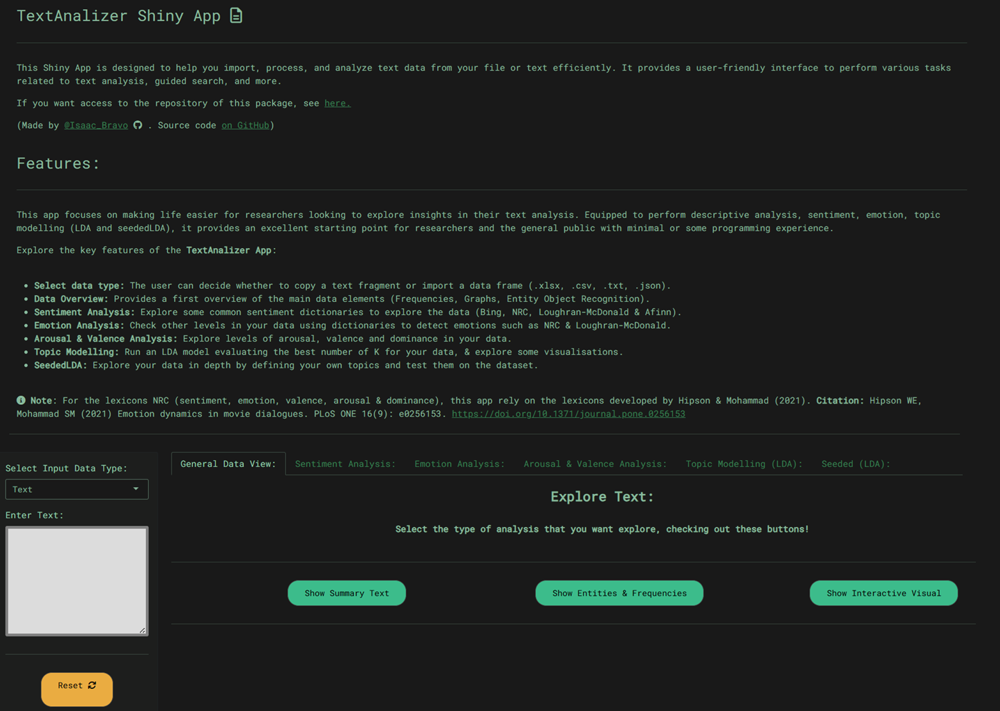

<p align="center">
  
</p>


## 📑 TextAnalizeR

---

The Text Analyzer Shiny App is an interactive tool for analyzing and visualizing text data. It allows users to perform various text analysis tasks, including sentiment analysis, word frequency analysis, and topic modelling. This README provides an overview of the app's features, how to use it, and how to get started.

This app focuses on making life easier for researchers looking to explore insights in their text analysis. Equipped to perform descriptive analysis, sentiment, emotion, topic modelling (LDA and seededLDA), it provides an excellent starting point for researchers and the general public with minimal or some programming experience.

### 🛠 Features
---
- **Select data type:** The user can decide whether to copy a text fragment or import a data frame (.xlsx, .csv, .txt, .json).

- **Data Overview:** Provides a first overview of the main data elements (Frequencies, Graphs, Entity Object Recognition).

- Sentiment Analysis:** Explore some common sentiment dictionaries to explore the data (Bing, NRC, Loughran-McDonald & Afinn).

- **Emotion Analysis:** Check other levels in your data using dictionaries to detect emotions such as NRC & Loughran-McDonald.

- **Arousal & Valence Analysis:** Explore levels of arousal, valence and dominance in your data.

- **Topic Modelling:** Run an LDA model evaluating the best number of K for your data, & explore some visualisations.

- **SeededLDA:** Explore your data in depth by defining your own topics and test them on the dataset.

### 🚀 Installation
---
To install the Text Analysis Shiny App Package, you can use the devtools package:

```r
# Install from GitHub
devtools::install_github("IsaacBravo/TextAnalyzer")
```
Replace your_username with your GitHub username and your_package_name with your repository name.

### 📌 Usage
---
Load the package and initiate the Shiny app with the following commands:

```r
library(TextAnalyzer)
TextAnalyzer::run_TextAnalyzer()
```

### 📷 Main Page
<p align="center">
  
</p>


