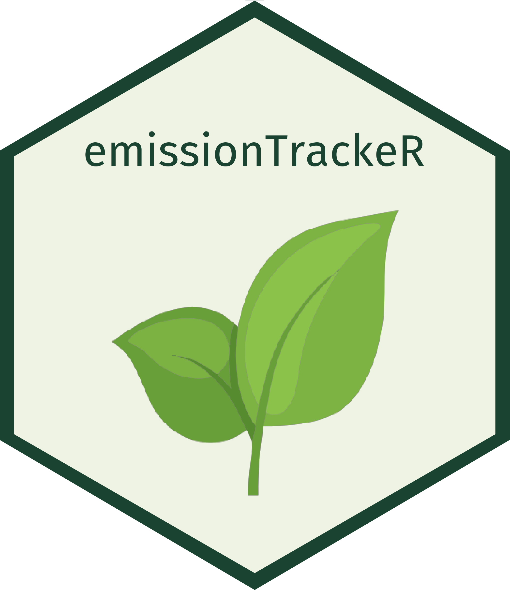

<p align="center">
  
</p>


## 📦 emissionTrackerR

---

emissionTrackerR is an R package that helps track, log, and visualize carbon emissions generated by your R code, ML experiments, and projects. It supports automatic logging, metadata collection, real-world emission equivalents, and a built-in Shiny dashboard. It is inspired by and conceptually based on the Python package CodeCarbon developed by ML CO2 Impact, and aims to bring similar functionality to the R ecosystem.

### 🚀 Installation
```r
# Install from GitHub
devtools::install_github("your-username/emissionTrackerR")
```

### 🔧 Basic Usage
```r
library(emissionTrackerR)

# Track emissions for a code block
track_emissions_for("example_sleep", {
  Sys.sleep(2)
})
```
Logs will be saved as:

- emissions_log.json
- emissions_log.csv

### 🧠 Example: Machine Learning Task
```r
library(emissionTrackerR)

# Track emissions for a code block
library(randomForest)

track_emissions_for("iris_rf_model", {
  data(iris)
  idx <- sample(nrow(iris), 0.8 * nrow(iris))
  train <- iris[idx, ]
  test <- iris[-idx, ]
  model <- randomForest(Species ~ ., data = train)
  acc <- mean(predict(model, test) == test$Species)
  print(acc)
})
```
### 🛠 Features

- **Automatic Emissions Tracking:** Monitor the carbon footprint of your R code execution seamlessly.​

- **Metadata Collection:** Gather contextual information about your experiments for comprehensive tracking.​

- **Real-World Equivalents:** Translate emissions data into relatable metrics (e.g., equivalent kilometers driven).​

- **Shiny Dashboard:** Visualize emissions data interactively through an integrated Shiny application.